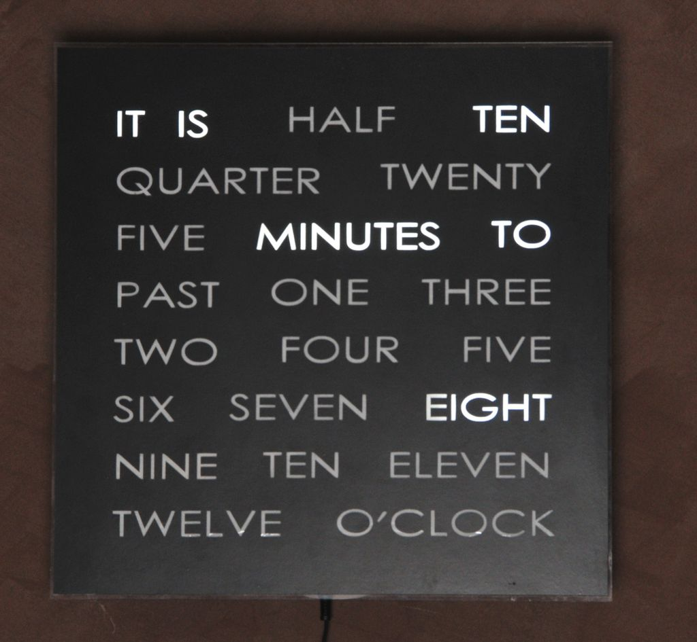

# word clock

Este es el codigo para un word clock, 
Modifiqué el stencil para mostrar un mensaje tipo "you are awesome" entre las letras. la idea es que sea imperceptible hasta que se ilumine. el set de letras tiene leds de otro color por debajo.

## mi  objetivo
Agregar el codigo para que ciertos dias. quizas  cada 15 dias, ilumine un conjunto de letras que no tiene nada que ver con la hora.

Estoy construyendolo para mi novia.
ya sé iluminar las letras que quiero . 
lo que no se es crear la logica para que se ilumine predeciblemente cada cierto numero de dias.
No seria malo tambien qeu se ilumine en su cumpleaños , aniversario etc.

como se ve construido

